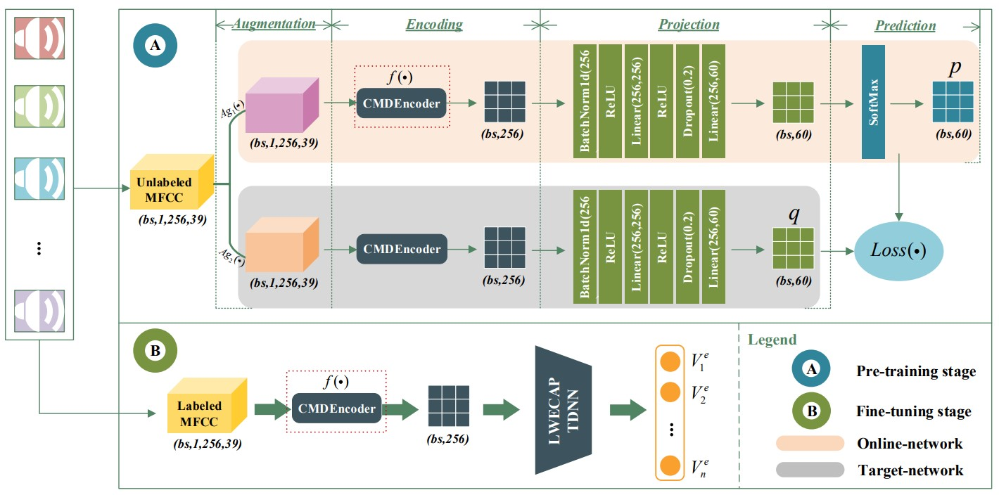
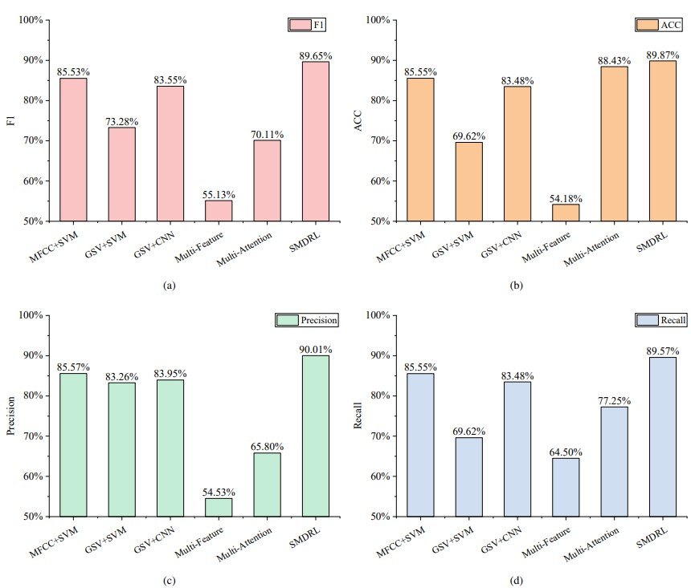

# SMDRL:  Self-Supervised Mobile Device Representation Learning Framework for Recording Source Identification from Unlabeled Data

## 📝Introduction📝
This repository contains the code implementation for the paper `SMDRL:  Self-Supervised Mobile Device Representation 
Learning Framework for Recording Source Identification from Unlabeled Data`. SMDRL is designed to address the problem of 
mobile recording device identification in real-world challenging sample scenarios. The framework leverages extensive 
unlabeled data for pre-training to enhance the training of the identification system. The purpose of each Python script 
file is as follows:

- `Augmentation.py` :Data Augmentation Methods.

- `CMDEncoder.py` :The Cross-scale Mobile Device Encoder structure designed in this paper.

- `ecapa_tednn.py` :The structure of the classifier 'ECAPA-TDNN'.

- `other mertricts.py` :Used to calculate all evaluation metrics except accuracy. 

- `SMDRL_classfier.py` :The network structure of the classifier 'LWECAP-TDNN' used in this paper.

- `SMDRL_fun_tuning.py` :Fine-tuning model training script.

- `SMDRL_pre_train.py` :Pre-trained model script for this paper.

- `SMDRL_pre_train_EMA.py` :Script for pre-training the model using the EMA parameter update method.

- `testacc.py` :Script for calculating accuracy on the test set.

If you find this project useful, please give us a star ⭐️. Your support is our greatest motivation!
## 📌Contributors📌
1. Yuhao Zhao : 102210253@hbut.edu.cn
2. Zhifeng Wang : zfwang@ccnu.edu.cn 

School of Electrical and Electronic Engineering, Hubei University of Technology, Wuhan 430068, China

## 📜Environment Requirement📜
python == 3.7 
torch == 1.12.0 
torchaudio == 0.12.0 
torchinfo == 1.8.0 
torchvision == 0.13.0 
numpy == 1.21.6 
scikit-learn == 1.0.2 
librosa == 0.8.0 
pandas == 1.1.5 
CUDA 11.3+ 

## 🚀Train and Test🚀 
After ensuring that each script can be correctly imported into the training script, run the pre-training script to obtain
the pre-trained model. Then, use the saved pre-trained model for downstream classification tasks and save the downstream
task model again. Finally, use the saved model for evaluation in the script file that calculates the relevant evaluation
metrics. Some comments in the training-related script files are intended to implement the ablation experiment design 
described in the paper.

## 🚀Performance🚀

If you have any other questions❓, please contact us in time 👬